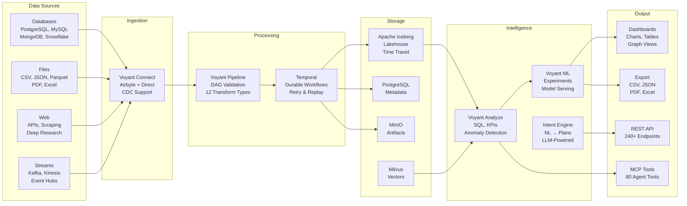
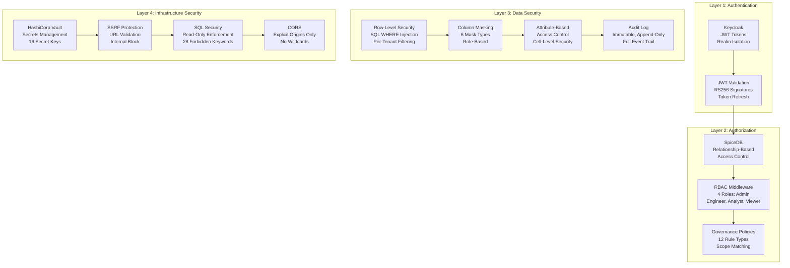
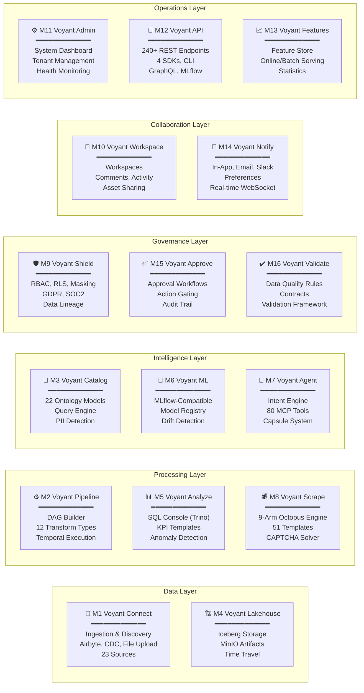
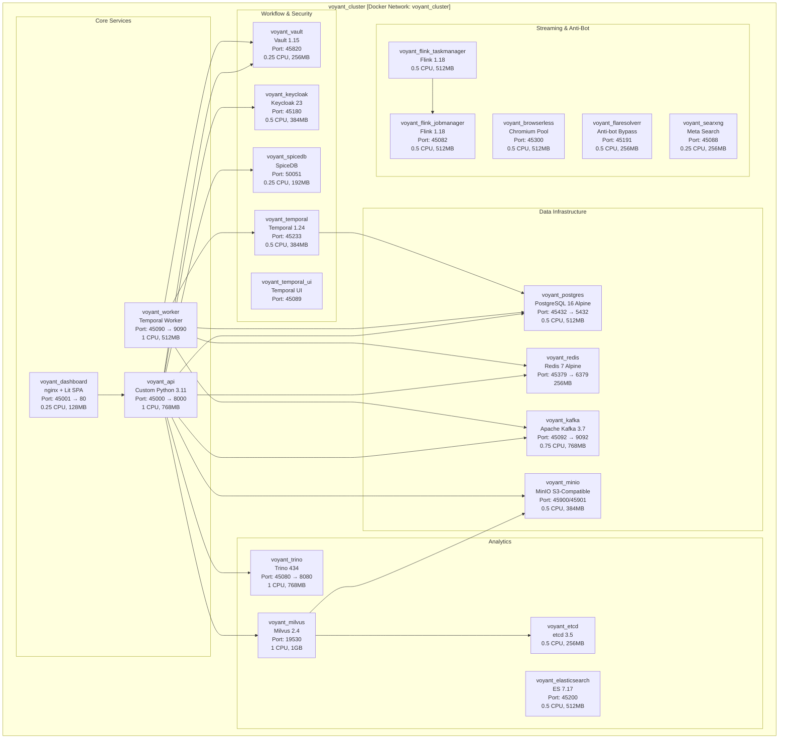
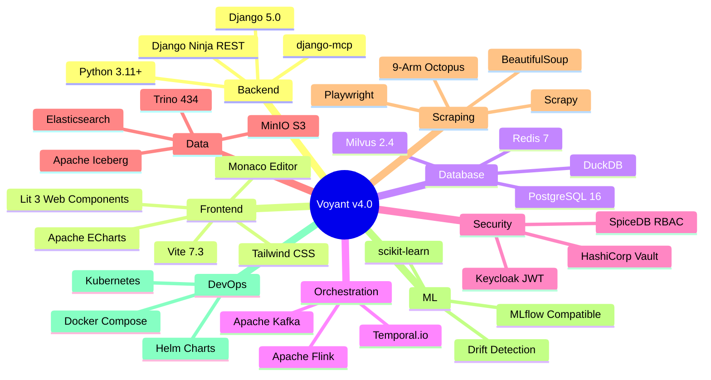

# VOYANT v4.0 — Executive Architecture Presentation
## Autonomous Data Intelligence for AI Agents

**Prepared for:** IT Leadership & Executive Review
**Date:** 2026-09-11
**Version:** 4.0.0
**Classification:** Internal

---

## 1. SYSTEM ACCESS — Login Credentials

### Dashboard URL
```
http://localhost:45001
```

### User Accounts (Keycloak Identity Provider)

| Role | Username | Password | Email | Access Level |
|------|----------|----------|-------|-------------|
| **System Admin** | `admin` | `admin` | admin@voyant.io | Full system access — all tenants, all modules, all settings |
| **Data Engineer** | `engineer` | `engineer` | engineer@voyant.io | Read all + write sources/jobs + execute SQL/pipelines + scraping |
| **Data Analyst** | `analyst` | `analyst` | analyst@voyant.io | Read all + execute SQL/presets + dashboards |

### Additional Service Ports

| Service | URL | Credentials |
|---------|-----|-------------|
| **API** | http://localhost:45000 | Bearer token via login |
| **Temporal UI** | http://localhost:45089 | No auth |
| **Keycloak Admin** | http://localhost:45180 | admin / *(see secrets)* |
| **Vault** | http://localhost:45820 | Token: `voyant-root-token` |
| **Trino** | http://localhost:45080 | No auth |
| **MinIO Console** | http://localhost:45901 | *(see secrets)* |
| **Flink UI** | http://localhost:45082 | No auth |
| **Milvus** | http://localhost:19530 | gRPC |
| **Elasticsearch** | http://localhost:45200 | No auth |
| **SearXNG** | http://localhost:45088 | No auth |

---

## 2. FULL SYSTEM ARCHITECTURE — Mermaid Diagram

### 2.1 High-Level Architecture

```mermaid
graph TB
    subgraph "External Users"
        HUMANS["👤 Human Users<br/>(Admin, Engineer, Analyst)"]
        AGENTS["🤖 AI Agents<br/>(MCP Protocol)"]
        EXTERNAL["🔌 External Systems<br/>(APIs, Webhooks)"]
    end

    subgraph "Presentation Layer"
        DASHBOARD["📊 Dashboard<br/>Lit 3 + Vite + Tailwind<br/>38 Views, 16 Components<br/>Port: 45001"]
        CLI["⌨️ CLI Tool<br/>Click-based<br/>voyant command"]
        SDK["📦 SDKs<br/>Python, TypeScript<br/>Go, Java"]
    end

    subgraph "API Gateway Layer"
        API["🚀 Voyant API<br/>Django 5 + Django Ninja<br/>~240 REST Endpoints<br/>Port: 45000"]
        MCP["🔧 MCP Server<br/>80 AI Agent Tools<br/>django-mcp at /mcp"]
        GQL["📊 GraphQL<br/>graphene-django<br/>at /graphql"]
        MLFLOW["🧪 MLflow API<br/>19 Compatible Endpoints<br/>at /api/2.0/mlflow/"]
        WS["🔌 WebSocket<br/>Django Channels<br/>Real-time Events"]
    end

    subgraph "Security Layer"
        KC["🔐 Keycloak<br/>JWT Authentication<br/>Port: 45180"]
        SPICE["🛡️ SpiceDB<br/>Fine-grained RBAC<br/>Port: 50051"]
        VAULT["🗝️ HashiCorp Vault<br/>Secrets Management<br/>Port: 45820"]
    end

    subgraph "Application Layer — 16 Modules"
        M1["M1 Connect<br/>Ingestion & Discovery"]
        M2["M2 Pipeline<br/>ETL & Temporal"]
        M3["M3 Catalog<br/>Ontology Engine"]
        M4["M4 Lakehouse<br/>Iceberg Storage"]
        M5["M5 Analyze<br/>SQL & Analytics"]
        M6["M6 ML<br/>Experiments & Serving"]
        M7["M7 Agent<br/>Intent & MCP"]
        M8["M8 Scrape<br/>9-Arm Octopus"]
        M9["M9 Shield<br/>Governance"]
        M10["M10 Workspace<br/>Collaboration"]
        M11["M11 Admin<br/>Operations"]
        M12["M12 API<br/>Gateway & SDKs"]
        M13["M13 Features<br/>Feature Store"]
        M14["M14 Notify<br/>Notifications"]
        M15["M15 Approve<br/>Workflows"]
        M16["M16 Validate<br/>Data Quality"]
    end

    subgraph "Orchestration Layer"
        TEMPORAL["⏱️ Temporal.io<br/>17 Workflows, 50+ Activities<br/>Durable & Replayable<br/>Port: 45233"]
        WORKER["⚙️ Temporal Worker<br/>Background Processing<br/>Port: 45090"]
    end

    subgraph "Data Layer"
        PG["🐘 PostgreSQL 16<br/>Metadata Store<br/>Port: 45432"]
        REDIS["⚡ Redis 7<br/>Cache, Sessions, Pub/Sub<br/>Port: 45379"]
        TRINO["🔍 Trino 434<br/>Distributed SQL<br/>Port: 45080"]
        MINIO["📦 MinIO<br/>Object Storage (S3)<br/>Port: 45900"]
        MILVUS["🧠 Milvus<br/>Vector Database<br/>Port: 19530"]
        KAFKA["📨 Apache Kafka<br/>Event Streaming<br/>Port: 45092"]
        ES["🔎 Elasticsearch<br/>Full-text Search<br/>Port: 45200"]
    end

    subgraph "Streaming Layer"
        FLINK["⚡ Apache Flink<br/>Real-time Analytics<br/>Port: 45082"]
    end

    subgraph "Anti-Bot Layer"
        BROWSERLESS["🌐 Browserless<br/>Chromium Pool<br/>Port: 45300"]
        FLARE["🔥 FlareSolverr<br/>Anti-bot Bypass<br/>Port: 45191"]
        SEARXNG["🔍 SearXNG<br/>Meta Search<br/>Port: 45088"]
    end

    HUMANS --> DASHBOARD
    AGENTS --> MCP
    EXTERNAL --> API
    DASHBOARD --> API
    CLI --> API
    SDK --> API
    API --> M1 & M2 & M3 & M4 & M5 & M6 & M7 & M8 & M9 & M10 & M11 & M12 & M13 & M14 & M15 & M16
    MCP --> M7
    GQL --> M3
    MLFLOW --> M6
    WS --> M10
    API --> KC & SPICE & VAULT
    M1 --> TEMPORAL
    M2 --> TEMPORAL
    M5 --> TEMPORAL
    M8 --> TEMPORAL
    TEMPORAL --> WORKER
    WORKER --> PG & REDIS & KAFKA & MINIO
    M3 --> TRINO
    M5 --> TRINO
    M4 --> MINIO
    M7 --> MILVUS
    M8 --> BROWSERLESS & FLARE & SEARXNG
    M9 --> ES
    KAFKA --> FLINK
```



### 2.2 Data Flow Architecture



### 2.3 Security Architecture



### 2.4 Module Architecture (16 Modules)



### 2.5 Infrastructure Topology (20 Docker Services)



### 2.6 Technology Stack Summary



---

## 3. KEY METRICS

| Metric | Value |
|--------|-------|
| Python LOC | ~73,416 |
| TypeScript LOC | ~9,099 |
| Django Apps | 22 |
| REST Endpoints | ~240 |
| MCP Tools | 80 |
| Temporal Workflows | 17 |
| Test Functions | 2,203 (2,128 passing) |
| Playwright E2E | 84 tests (81 passing) |
| Docker Services | 20 |
| LLM Providers | 7 |
| Scraper Templates | 51 |
| Ontology Models | 22 |
| SDKs | 4 (Python, TypeScript, Go, Java) |
| SRS Completion | 87% (77/89) |

---

## 4. COMPETITIVE POSITION

| Capability | Palantir Foundry | Databricks | **Voyant v4.0** |
|-----------|-----------------|------------|-----------------|
| Ontology Engine | ✅ | ❌ | ✅ (22 models) |
| MCP Agent Protocol | ❌ | ❌ | ✅ (80 tools) |
| Web Scraping | ❌ | ❌ | ✅ (9-arm engine) |
| Self-Hosted | ❌ | ❌ | ✅ (Docker) |
| MLflow Compatible | ❌ | ✅ | ✅ (19 endpoints) |
| Visual Pipeline Builder | ✅ | ✅ | ✅ (DAG editor) |
| Real-time Streaming | ✅ | ✅ | ✅ (Flink + Kafka) |
| RBAC + RLS + Masking | ✅ | ✅ | ✅ (3-layer) |
| Open Source | ❌ | ❌ | ✅ (Apache 2.0) |
| Agent-First Design | ❌ | ❌ | ✅ (native) |

---

## 5. DEPLOYMENT

### Quick Start
```bash
cd infra/standalone
./scripts/bootstrap-env.sh
docker compose up -d
```

### Total Resource Requirements
- **CPU:** ~10 cores
- **RAM:** ~10 GB
- **Disk:** ~20 GB (including images)
- **Ports:** 45xxx range (no conflicts with local services)

---

*Document generated by Voyant Engineering — Ready for PPT conversion*
